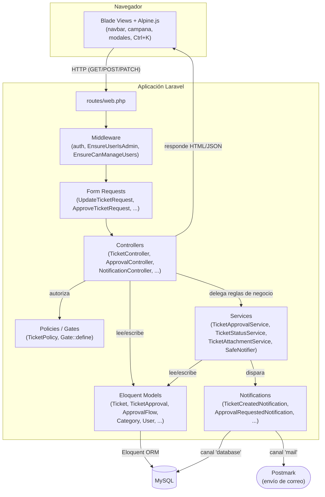

# Arquitectura Técnica de TicketUS

## 1. Stack tecnológico

### Backend

| Tecnología | Rol en el proyecto | Por qué se eligió |
|---|---|---|
| **PHP 8.3** | Lenguaje del backend | Versión estable con soporte de tipado moderno (enums, readonly properties, `?->`) que el código ya aprovecha (ej. `$category?->approvalFlow?->levels`). |
| **Laravel 13** | Framework MVC | Da de fábrica routing, ORM, validación (Form Requests), autorización (Policies/Gates), Notifications multi-canal y testing HTTP — todo lo que el dominio de tickets necesita (aprobaciones, adjuntos, estados) sin reinventar infraestructura. |
| **MySQL** | Base de datos relacional | El dominio es intrínsecamente relacional (tickets → categorías → flujos de aprobación → niveles → aprobaciones), con integridad referencial y transacciones (`DB::transaction()` en `TicketApprovalService`) como requisito, no accesorio. |
| **Laravel Breeze** | Autenticación | Scaffolding mínimo y sin dependencias de SPA (no se necesita un framework JS pesado para login/registro/perfil). |
| **Laravel Notifications** (canales `mail` + `database`) | Notificaciones a usuarios | Permite reutilizar la misma clase de notificación (ej. `TicketCreatedNotification`) para correo y para la bandeja in-app, sin duplicar la lógica de "qué avisar" en dos sitios. |
| **Postmark** (vía `symfony/postmark-mailer`) | Envío real de correo | Transporte de entrega gestionado (deliverability, bounces, tasa de envío) en vez de SMTP casero; el proyecto ya maneja explícitamente sus fallos (`SafeNotifier`, direcciones demo que rebotan). |
| **maatwebsite/excel** | Exportar reportes a Excel | Estándar de facto en Laravel para generar `.xlsx` desde colecciones Eloquent sin manejar el formato binario a mano. |
| **barryvdh/laravel-dompdf** | Exportar reportes a PDF | Renderiza los mismos reportes a PDF reutilizando vistas Blade como plantilla, sin un segundo motor de reportes. |
| **Queue: `database`** | Cola de trabajos | Configurado como infraestructura base, aunque las notificaciones actuales son síncronas (no implementan `ShouldQueue`) — decisión deliberada para que un fallo de Postmark se sepa en el mismo request en vez de perderse en un worker. |

### Frontend

| Tecnología | Rol en el proyecto | Por qué se eligió |
|---|---|---|
| **Blade** | Motor de plantillas | Renderizado server-side: cada vista ya recibe datos autorizados y formateados por el controlador, sin necesitar una API JSON paralela para una SPA. |
| **Alpine.js** | Interactividad ligera | Da `x-data`/`x-show`/`x-model` para dropdowns, modales, la campana de notificaciones y el buscador Ctrl+K sin el costo de build/estado de un framework como Vue o React — coherente con una app que es, en esencia, formularios y tablas. |
| **Tailwind CSS** | Utilidades de estilo | Clases utilitarias disponibles vía Vite; en la práctica conviven con bastante estilo inline en las vistas más antiguas del proyecto. |
| **Chart.js** | Gráficas del dashboard | Librería madura y liviana para las gráficas de estado/historial de tickets, cargada vía CDN sin overhead de build adicional. |
| **Tabler Icons** | Iconografía | Set de iconos consistente (vía CDN) usado en toda la UI (campana, adjuntos, acciones). |
| **Vite** | Build de assets | Estándar actual de Laravel para compilar CSS/JS con HMR en desarrollo. |

### Testing e infraestructura

- **PHPUnit** con `RefreshDatabase`: tests de **feature HTTP reales** (login, POST/PUT a rutas reales, aserciones sobre la base de datos), no solo unitarios — coherente con un dominio donde el riesgo está en el flujo completo (crear → aprobar → asignar), no en funciones aisladas.
- **Laragon** como entorno de desarrollo local (Windows).
- **Railway** como destino de deploy (según el historial de commits del repo).

---

## 2. Diagrama de capas

**Flujo típico** (crear un ticket con flujo de aprobación):

1. El navbar (Alpine.js) o el formulario de creación hace un `POST /tickets` (Blade → Controller).
2. `TicketController::store()` valida con las reglas inline / `UpdateTicketRequest`, delega el cálculo de estado inicial y niveles de aprobación a los datos de `Category`/`ApprovalFlow` (Models).
3. Persiste el `Ticket` y sus `TicketApproval` vía Eloquent → **MySQL**.
4. Dispara `TicketCreatedNotification` / `NewTicketNotifyAdminsNotification` vía `SafeNotifier`, que las envía por los canales `database` (tabla `notifications` en MySQL, alimenta la campana) y `mail` (→ **Postmark**), atrapando cualquier fallo de Postmark sin afectar la respuesta HTTP.
5. Redirige a la vista `tickets.index`, que Blade renderiza con los datos ya cargados por el Controller.

---

## 3. Patrones de diseño usados en el proyecto

### Service Layer (clases de servicio)
La lógica de negocio no vive en los controllers: se delega a clases dedicadas en `app/Services/`.
- **`TicketApprovalService`** — reglas del flujo de aprobación (orden de niveles, auto-aprobación prohibida, doble voto, transición a `open`/`rejected`), envuelto en `DB::transaction()` para consistencia.
- **`TicketStatusService`** — única fuente de verdad de qué transiciones de estado son válidas (`SIMPLE_TRANSITIONS`, `GUARDED_TRANSITIONS`), consumida por el Kanban, el selector rápido y los guards de cada acción, en vez de reimplementar la matriz de estados en cada controller.
- **`TicketAttachmentService`** — validación y storage de adjuntos, reutilizada tanto en la creación de tickets como en `TicketAttachmentController`, para no duplicar reglas de tamaño/mimes en dos sitios.

### Form Requests (validación desacoplada del controller)
Cada acción sensible tiene su propia clase en `app/Http/Requests/` (`UpdateTicketRequest`, `ApproveTicketRequest`, `RejectAdhocTicketRequest`, `AssignApprovalRequest`, `ReopenTicketRequest`, etc.), con `authorize()` + `rules()` + `withValidator()` para reglas cruzadas (ej. "un ticket en `pending_approval` no puede cambiar de estado desde el formulario genérico"). Mantiene los controllers como orquestadores delgados.

### Wrapper / fault-isolation pattern — `SafeNotifier`
`SafeNotifier::send()` envuelve cada `->notify()` del proyecto en un `try/catch`, de forma que un fallo del proveedor de correo (timeout, rate-limit, dirección rechazada por Postmark) nunca tumbe la operación de negocio que lo disparó (crear ticket, aprobar, asignar). Es el único punto por el que pasan las notificaciones del ciclo de vida de tickets/aprobaciones — un test dedicado (`test_every_notify_call_site_is_protected_against_mail_failures`) verifica que no quede ningún `->notify()` crudo fuera de este wrapper.

### Policy pattern (autorización)
`TicketPolicy` centraliza las reglas de "quién puede ver/editar/borrar un ticket", consumida vía `$this->authorize()` en los controllers en vez de condicionales de rol dispersos. Reglas más simples de "quién puede administrar" usan `Gate::define()` directamente (`manage-users`, middleware `EnsureUserIsAdmin`/`EnsureCanManageUsers`).

### State Machine (tabla de transiciones como dato, no como `if/else`)
`TicketStatusService::SIMPLE_TRANSITIONS` / `GUARDED_TRANSITIONS` modelan el ciclo de vida del ticket (`open → assigned → in_progress → resolved`, más las ramas de aprobación/cancelación) como una tabla declarativa consultada por `canTransition()`/`validTargets()`, en vez de si-entonces repetidos en cada acción.

### Notification pattern multi-canal (Observer-like)
Cada evento de negocio relevante (ticket creado, asignado, comentado, aprobación requerida/rechazada, cambio de estado) tiene su propia clase `Notification` con `toMail()` **y** `toDatabase()`/`toArray()`, de modo que un mismo evento notifica a la vez por correo y a la bandeja in-app sin duplicar el "qué decir" en dos lugares.

### On-demand notifiable (envío sin modelo `User`)
El aviso adicional a una dirección fija de administración usa `Notification::route('mail', $email)->notify(...)`, reutilizando la misma clase de `Notification` que reciben los admins reales, sin necesidad de un `User` persistido para ese destinatario.

### View Composer
`AppServiceProvider::boot()` inyecta el catálogo de categorías/subcategorías en la vista `layouts.navigation` vía `View::composer(...)`, en vez de que cada controller tenga que pasarlo manualmente para alimentar el buscador del navbar.

### Feature testing como red de seguridad de comportamiento
Los tests (`tests/Feature/*`) no son unitarios sobre funciones aisladas: simulan el flujo HTTP real (`actingAs()->post(route(...))`) y aseveran sobre estado en base de datos y notificaciones disparadas — el patrón de prueba elegido para un dominio donde el riesgo vive en la interacción entre capas (Controller → Service → Model → Notification), no en una función suelta.
